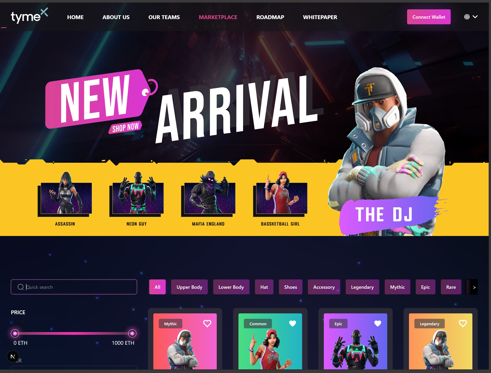
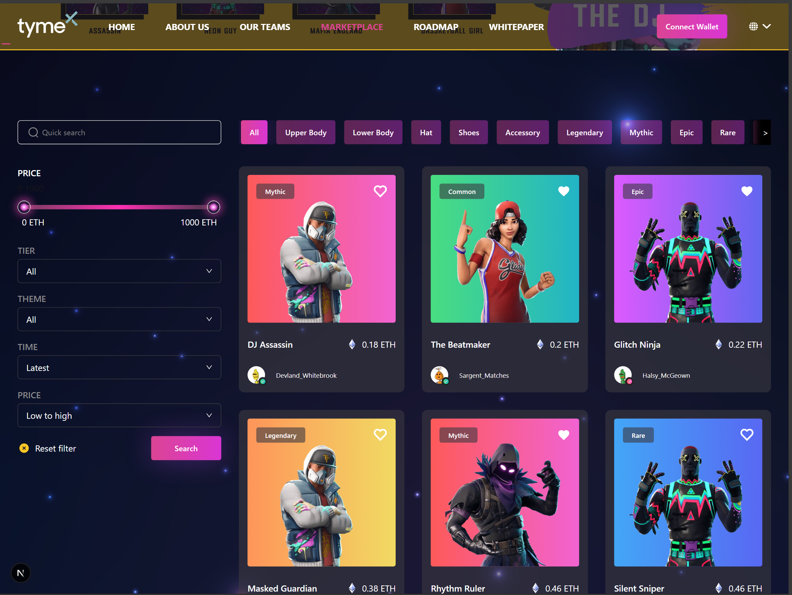

# TymeX Digital Asset Marketplace

A modern web application for browsing and trading digital assets, built with Next.js, React, and TypeScript.

## 🏗 Architecture Overview

This project implements a feature-based architecture with clean separation of concerns, following modern React best practices.

### Requirements
- Node.js 18+
- npm or yarn
- Modern browser support

## 📦 Project Structure

### 🎯 Main App
- **TymeX Marketplace** - Next.js application with app router
   

### 🔨 Core Components
#### Layout
- One-column layout
- Responsive design
- Consistent UI structure

#### Components
- Reusable UI elements
- Button
- Search
- Card components
- Skeleton loaders

#### Features
- Product browsing
- Filtering
- Search functionality
- Category navigation

### 💾 Data Layer

#### Hooks
- Custom React hooks
- Data fetching
- State management
- Search and filter logic

#### Services
- API client
- Data fetching
- Error handling

### 🎪 Product Features
#### Product Container
- Product listing
- Filter management
- Search integration
- Responsive grid layout

#### Product Components
- NFT Cards
- Hero Banner
- Category Filters
- Modal Filters

###  🧪 Testing
#### Test Features
- Jest and React Testing Library
- Unit tests for hooks and components

#### Test Coverage
- Overall: 79%

| % Stmts | % Branch | % Funcs | % Lines | 
|---------|----------|---------|---------|
|   84.82 |    82.14 |   63.93 |   85.09 |

